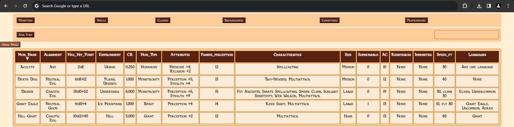
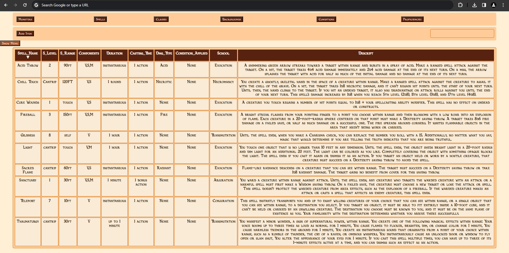
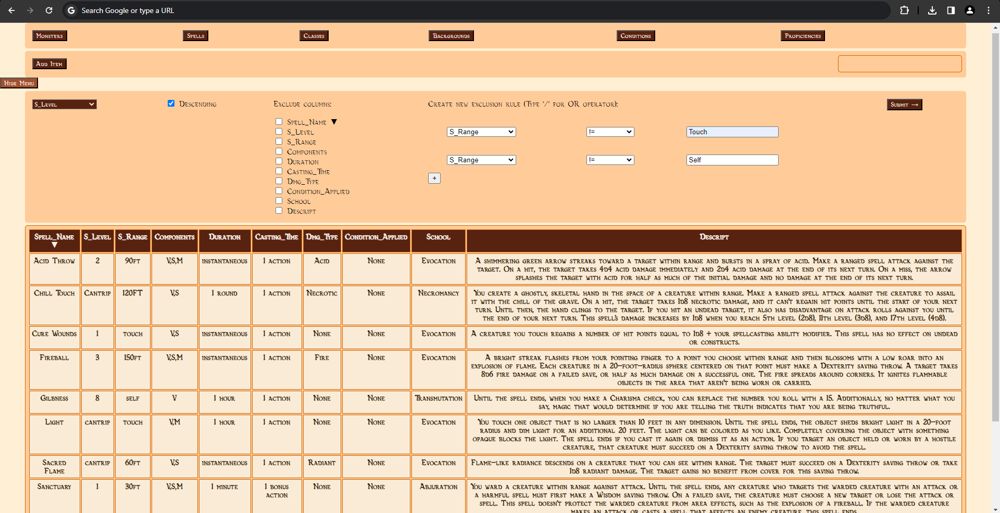
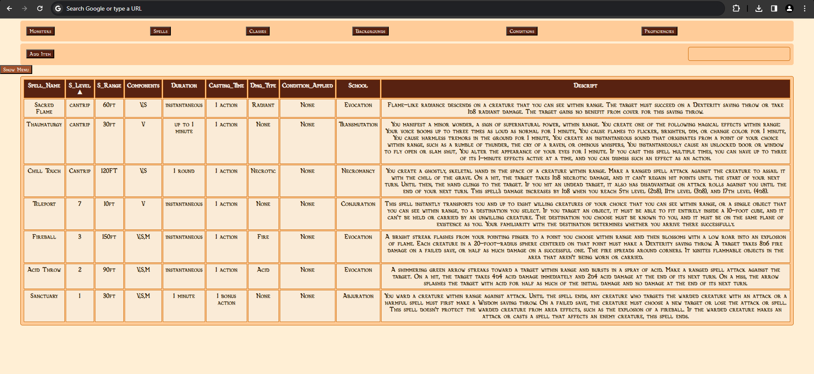

This is a database that started as a school project, but quickly outgrew the original required scope. On top of the SQL relational database that was created as a collaboration between me and two others, I created a Python frontend that serves HTML pages. This project utilizes the Flask library to interface with the database and respond to HTML requests.

An interface built in HTML and served with Python.

The unfiltered Spells page.

Various filtering and ease-of-use features. Note the order by column, column exclusion, and filter options.

An example of a filtered search of information in the database.
